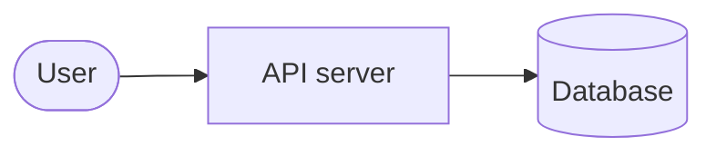

# Mermaid

Mermaid はテキストから図を生成する。GitHub の ```` ```mermaid ```` フェンスがそのまま描画されるため
README/Issue/PR との相性がよい。CLI の `mmdc` で SVG/PNG/PDF に、`mermaid-ascii` で ASCII にできる。

- 使い分けの判断: `diagram-tool-choice` を参照
- **記法（文法）**: [`references/syntax.md`](references/syntax.md)
- **コピー用の雛形と索引**: [`references/templates.md`](references/templates.md)（実体は `templates/`）

> 雛形は本文に置かない。`references/templates.md` で選び、`templates/<name>.mmd` をコピーして使う。

## インストール

```sh
npm install -g @mermaid-js/mermaid-cli     # mmdc
mmdc --version

# ASCII 表示（Go 製・brew には未収録）
GOBIN=/opt/homebrew/bin go install github.com/AlexanderGrooff/mermaid-ascii@latest
```

> `mmdc` は puppeteer 経由で Chromium を使う。初回にダウンロードが走る。
> コンテナ等で sandbox エラーになる場合は puppeteer 設定 JSON を `-p` で渡す（`args: ["--no-sandbox"]`）。

## CLI 早見表（mmdc）

```sh
mmdc -i in.mmd -o out.svg
mmdc -i in.mmd -o out.png -b white -s 2
```

| 目的 | フラグ |
| --- | --- |
| 入力 / 出力 | `-i, --input` / `-o, --output`（`.svg` `.png` `.pdf` `.md`、`-` で stdin/stdout） |
| 形式 | `-e, --outputFormat svg\|png\|pdf`（未指定なら拡張子から） |
| テーマ | `-t, --theme default\|forest\|dark\|neutral` |
| 背景 | `-b, --backgroundColor white\|transparent\|#F0F0F0` |
| 倍率 | `-s, --scale 2` |
| ページ寸法 | `-w, --width` / `-H, --height`（既定 800×600） |
| 設定 JSON | `-c, --configFile`（mermaid の `initialize` 相当） |
| CSS | `-C, --cssFile` |
| Markdown 入出力 | `-i doc.md` で ```` ```mermaid ```` を抽出、`-o out.md` で書き戻し、`-a` で成果物パス |
| 並列数 | `-j, --jobs` |
| puppeteer 設定 | `-p, --puppeteerConfigFile` |
| アイコン | `--iconPacks @iconify-json/logos` など |
| 静音 | `-q, --quiet` |

## CLI 早見表（mermaid-ascii）

```sh
mermaid-ascii -f in.mmd                  # Unicode ボックス
mermaid-ascii -f in.mmd --ascii          # 純 ASCII（+ - | >）
mermaid-ascii -f in.mmd -x 2 -y 1 -p 0   # 余白を詰めて幅を小さく
cat in.mmd | mermaid-ascii               # stdin
mermaid-ascii web --port 3001            # Web UI
```

| フラグ | 意味 |
| --- | --- |
| `-f, --file` | 入力ファイル（`-` で stdin） |
| `-a, --ascii` | 拡張文字を使わない（純 ASCII） |
| `-x, --paddingX` | ノード間の水平余白（既定 5） |
| `-y, --paddingY` | ノード間の垂直余白（既定 5） |
| `-p, --borderPadding` | ボックス内の余白（既定 1） |
| `--max-width` | 最大幅（`auto` か数値。環境により効きが弱い） |
| `-c, --coords` | 座標表示 |

> `mermaid-ascii` の対応は限定的（flowchart/graph、sequenceDiagram など）。subgraph・スタイル・
> 一部の shape は無視される。複雑な図は mmdc で画像化した方が確実。

## ワークフロー

1. [`references/templates.md`](references/templates.md) で図種を選び、`templates/<name>.mmd` をコピー
2. 編集する
3. **必ずレンダリングして検証**（構文エラーは mmdc が教える）
4. 出力を選ぶ
   - GitHub/README → ```` ```mermaid ```` フェンスにそのまま貼る
   - 配布・固定 → mmdc で SVG/PNG を生成
   - ターミナル → mermaid-ascii（限界あり。ASCII 重視なら d2 も検討）

## 最小例（動作確認用）



```sh
mmdc -i diagram.mmd -o diagram.svg
mmdc -i diagram.mmd -o diagram.png -b white -s 2
```

## 図種（mmdc 11.17 で描画確認済み）

`flowchart` / `sequenceDiagram` / `classDiagram` / `stateDiagram-v2` / `erDiagram` /
`gantt` / `pie` / `journey` / `gitGraph` / `mindmap` / `timeline` /
`quadrantChart` / `requirementDiagram` / `sankey-beta` / `xychart-beta` / `block-beta`

各図種の雛形は `templates/`、記法は [`references/syntax.md`](references/syntax.md) を参照。

## GitHub / README への埋め込み

- ```` ```mermaid ```` フェンスがそのまま描画される（画像をコミット不要）
- タイトル・テーマは front-matter と `%%{init: ...}%%`（[`references/syntax.md`](references/syntax.md) の「共通」）
- GitHub のテーマは読者環境依存。固定したいなら SVG/PNG をコミット

## テーマ / スケール

```sh
mmdc -t forest -b transparent -s 2 -i in.mmd -o out.svg
```

## ターミナル / ASCII

```sh
mermaid-ascii -f in.mmd -x 2 -y 1 -p 0
```

目安: 4 ノード CLOS で ≒ 83×19（余白を詰めた場合）。

## 落とし穴

- `mmdc` は Chromium を起動するため遅い。watch 的に使うなら呼び出し回数を抑える
- ノード/エッジのラベルに `()` `[]` `,` などを含めるときは引用符で囲む（`A["a, b"]`）
- 複数行は `A["1行目<br/>2行目"]`
- `mermaid-ascii` は subgraph・スタイル・一部 shape を無視する
- init ディレクティブは行頭 `%%{init: ...}%%`（`%%` のコメントと混同しやすい）

## 参考

- 公式: <https://mermaid.js.org/> / オンライン編集: <https://mermaid.live/>
- 記法: [`references/syntax.md`](references/syntax.md)
- 雛形: [`references/templates.md`](references/templates.md)
