# Mermaid 記法チートシート

`@mermaid-js/mermaid-cli 11.17.0` で描画確認済み。

## 共通

````markdown
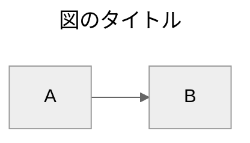
````

- 1 ファイル 1 図が基本（`mmdc -i doc.md` なら複数可）
- コメントは `%%`（`%%{init: ...}%%` と混同しないよう行頭で使う）

## flowchart / graph

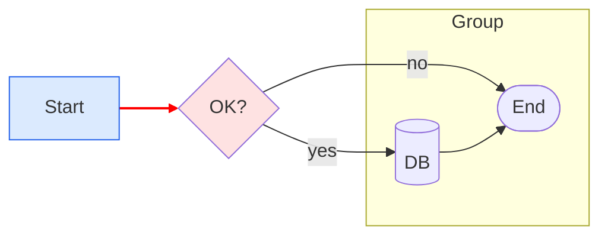

- 方向: `LR` `RL` `TB` `TD` `BT`
- 形状:

  | 記法 | 形 |
  | --- | --- |
  | `A[text]` | 四角 |
  | `A(text)` | 角丸 |
  | `A([text])` | スタジアム/丸 |
  | `A[[text]]` | サブルーチン |
  | `A[(text)]` | データベース（円柱） |
  | `A((text))` | 円 |
  | `A{text}` | ひし形 |
  | `A{{text}}` | 六角形 |
  | `A[/text/]` | 平行四辺形 |
  | `A[\text\]` | 逆平行四辺形 |
  | `A>text]` | 旗 |

- エッジ: `-->` `---` `-.->` `==>` `--o` `--x` `<-->`、ラベル `-->|t|` / `-- t -->`
- 複数行: `A["line1<br/>line2"]`

## sequenceDiagram

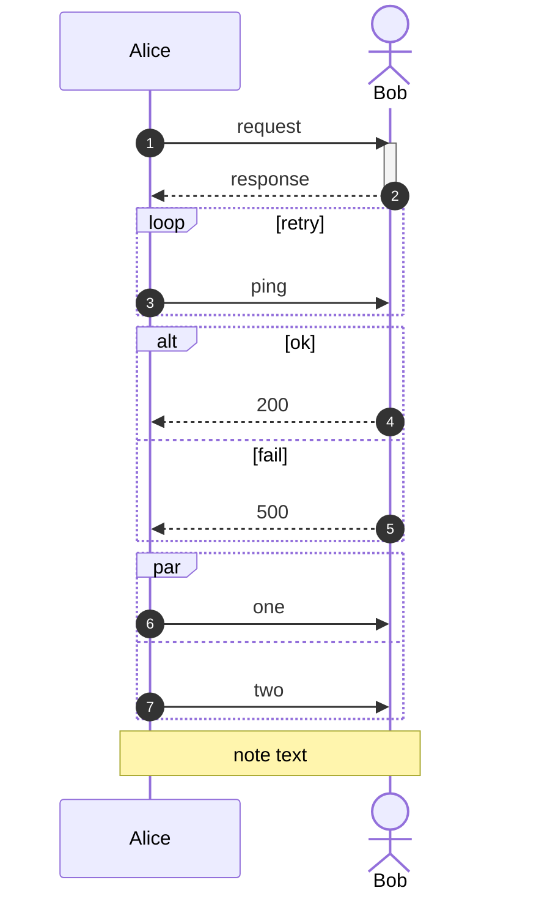

- 矢印: `->>`（実線矢印）`-->>`（破線）`->`（線）`-x` `-)` `<<->>` `<<-->>`
- ブロック: `loop` `alt/else` `opt` `par/and` `critical` `rect`、`activate/deactivate`、`Note`

## classDiagram

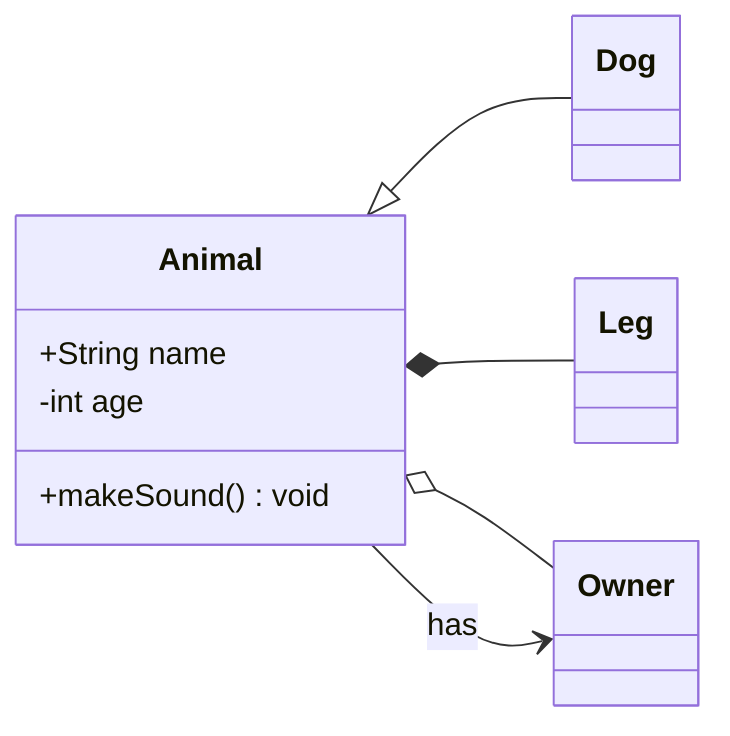

- 関係: `<|--`（継承）`*--`（コンポジション）`o--`（集約）`-->`（関連）`..>`（依存）`..|>`（実現）

## stateDiagram-v2

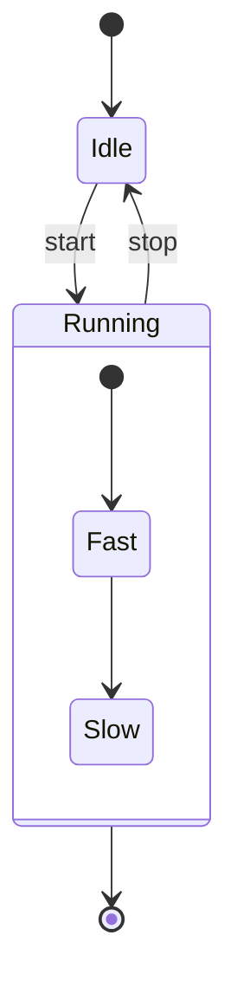

## erDiagram

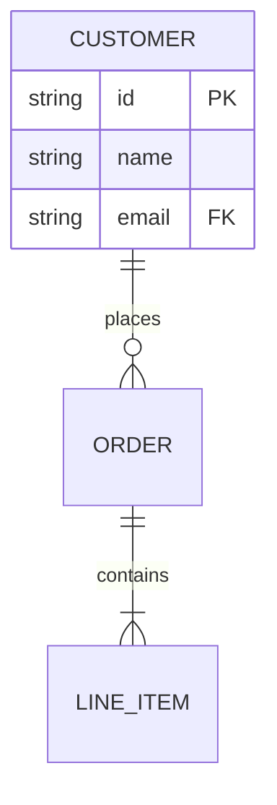

- 基数: `||--||`（1対1）`||--o{`（1対多）`}o--||` `}o--o{`（多対多）
- 属性のキー: `PK` `FK` `UK`

## gantt

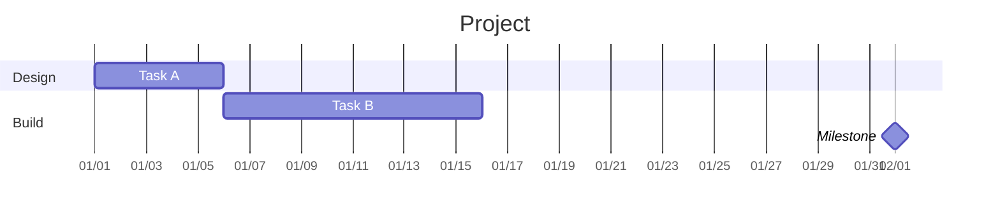

## pie

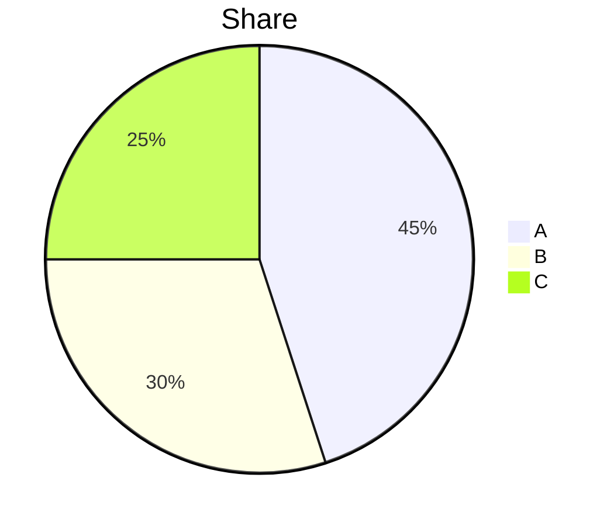

## journey

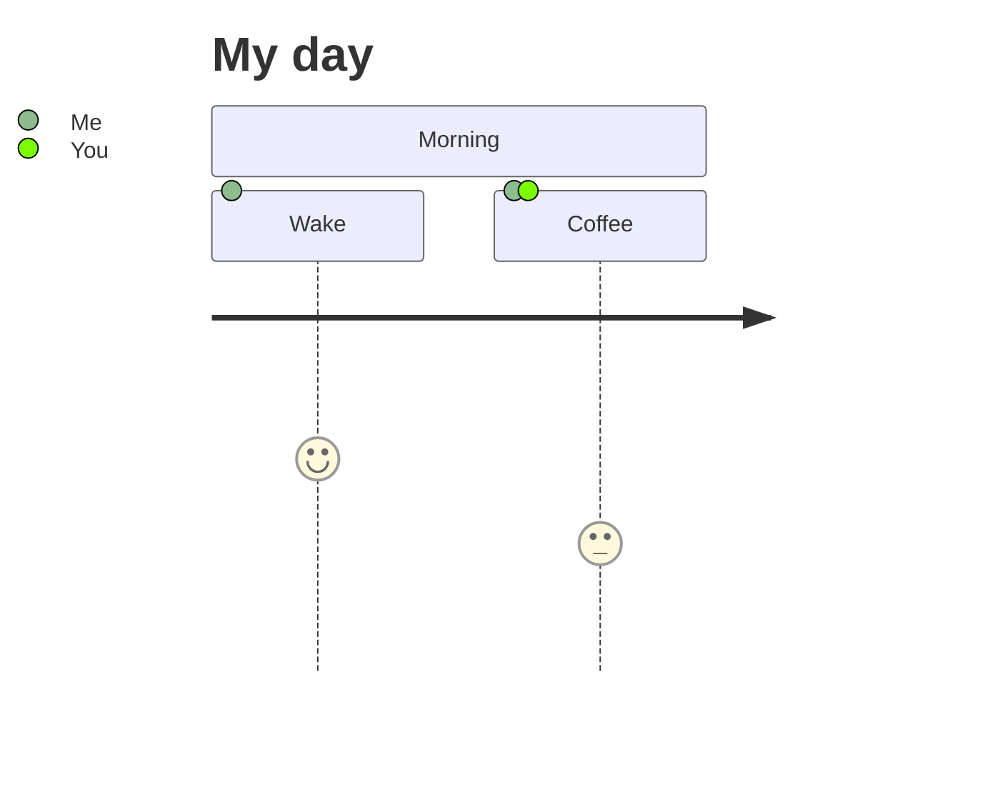

## gitGraph

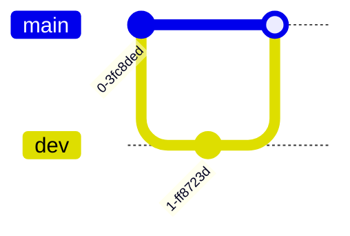

## mindmap

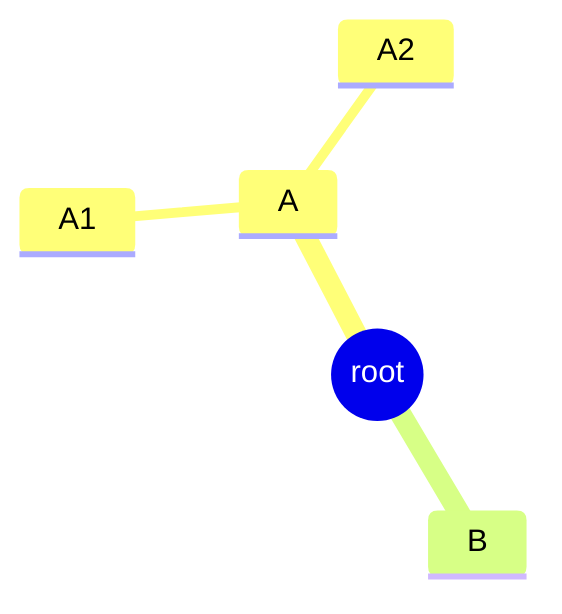

## timeline

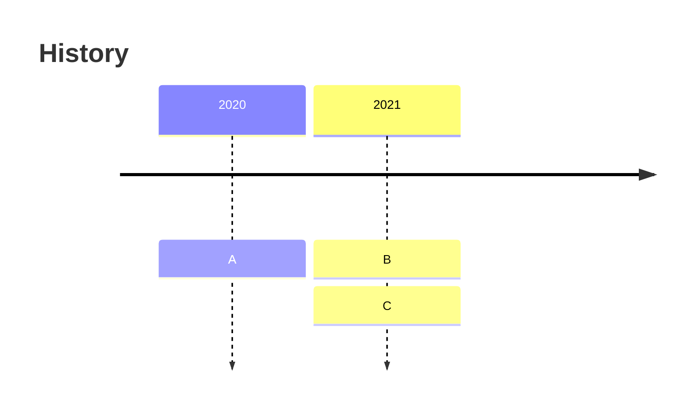

## quadrantChart

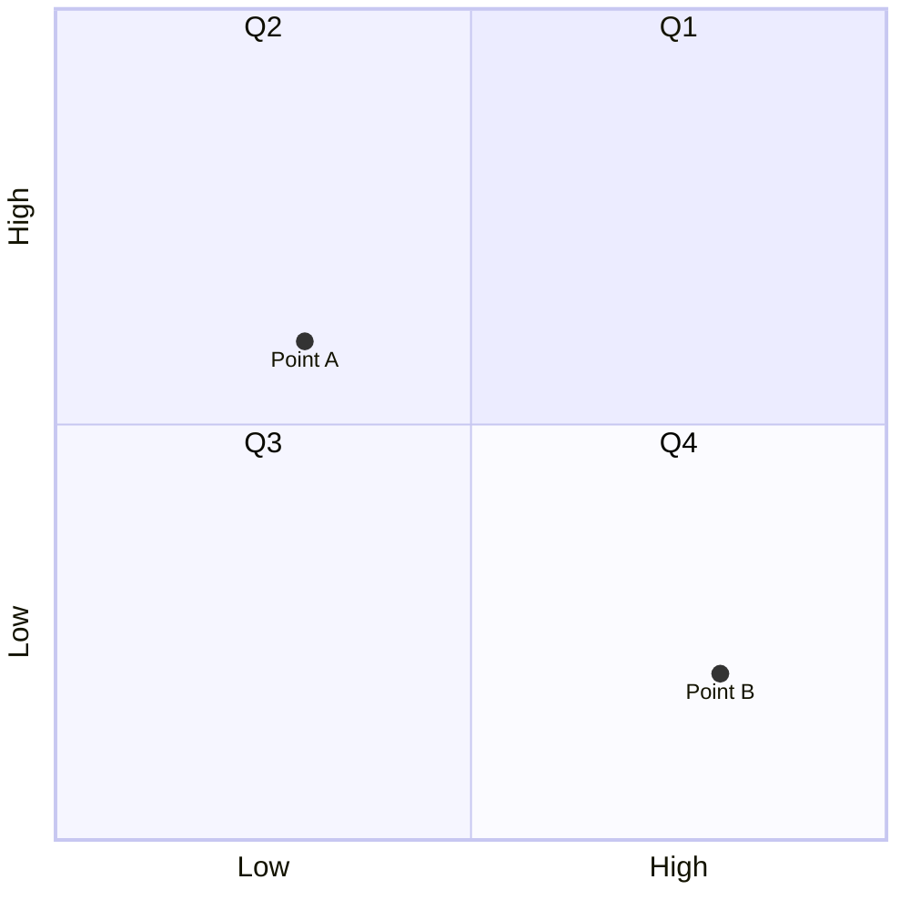

## requirementDiagram

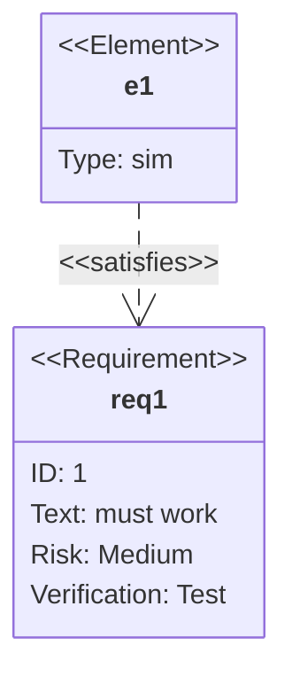

## sankey-beta

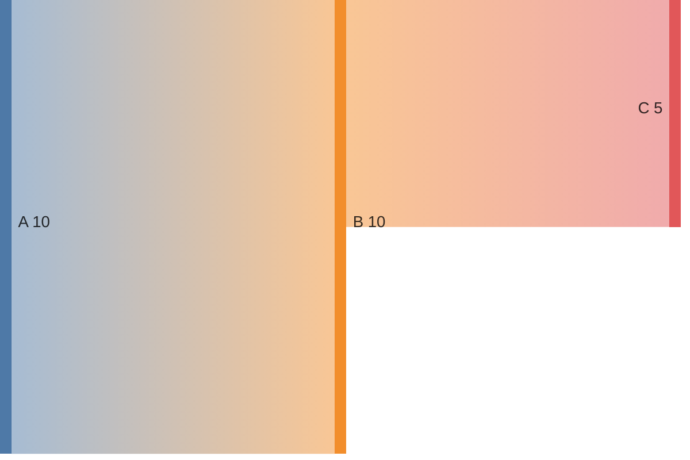

## xychart-beta

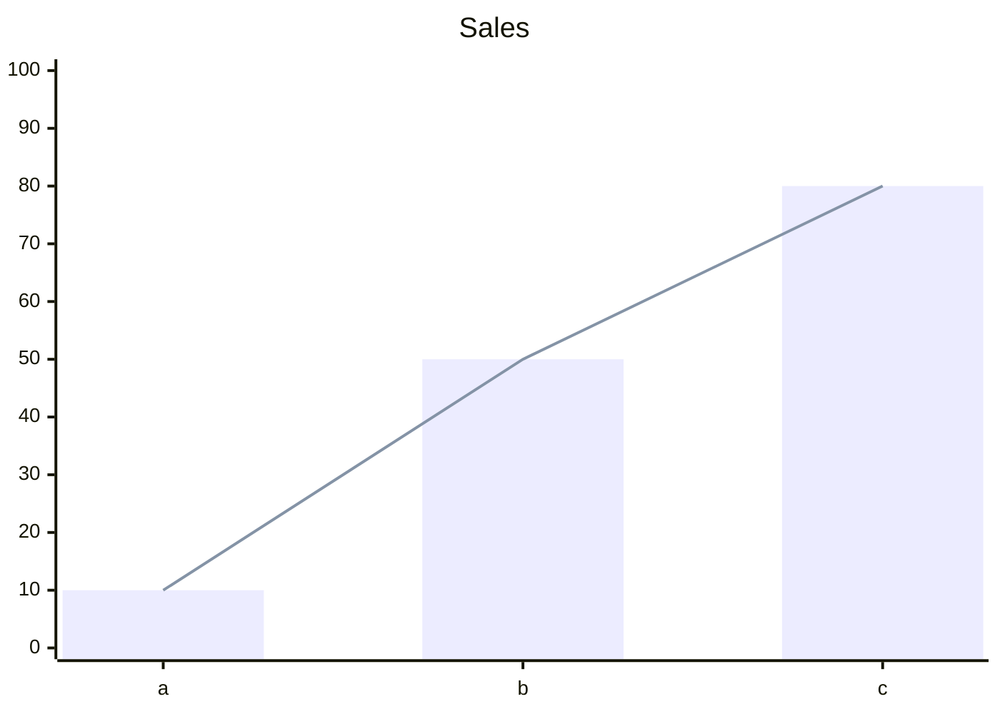

## block-beta

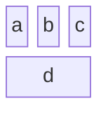

## CLI 補足

```sh
# Markdown 内の ```mermaid を一括レンダリング
mmdc -i doc.md -o out.md -a ./assets      # 画像を書き戻し

# 設定ファイル（mermaid の initialize 相当）
mmdc -i in.mmd -o out.png -c mermaid-config.json

# puppeteer 設定（コンテナで --no-sandbox）
mmdc -i in.mmd -o out.png -p puppeteer-config.json
```

```jsonc
// puppeteer-config.json
{ "args": ["--no-sandbox", "--disable-setuid-sandbox"] }
```

## mermaid-ascii の制約

- 対応: flowchart / graph、sequenceDiagram など（図種により精度が違う）
- 無視される: subgraph、classDef/style/linkStyle、一部の shape（六角形・円柱などは四角に近似）
- 余白: `-x`（水平）`-y`（垂直）`-p`（ボックス内）で詰める
- 例: `mermaid-ascii -f in.mmd -x 2 -y 1 -p 0`
